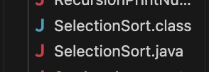
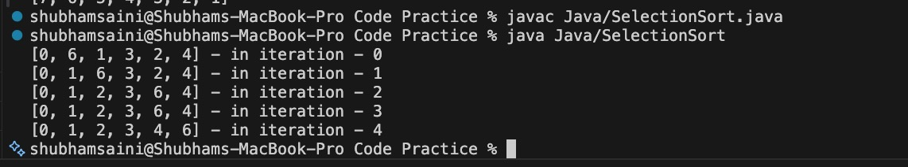
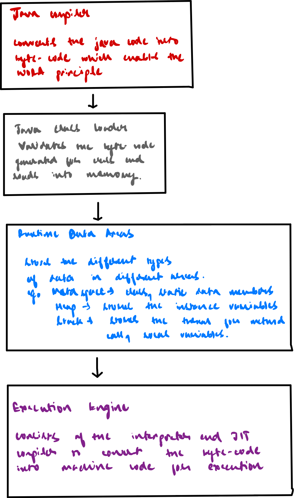

**PROJECT-I** Installation And Set-UP

• Download the JDK-25 from Oracle for Mac, by using the ARM64 dmg
version, and use the installer to install the JDK on the device.This
adds the JDK but doesn’t necessarily make it default

• To make it default, we need to update the environment variables. By
adding the installation path to JAVA_HOME, we make it accessible to our
IDES and other tools to use. To make it accessible from any directory,
we add it to PATH.

> • To do this, we run the command /usr/libexec/java_home on terminal,
> and the result is then added to the value of JAVA_HOME
>
> • This is done by export JAVA_HOME = “result of prev command”  
> • For Path we do,
>
> • export PATH=“\$JAVA_HOME/bin:\$PATH”. This command specifically cause
> it appends the rest of the path variables after this version. Since
> path is checked in order for executables
>
> which match, this helps run our current version eve if older version
> already exists.

Screenshots for Installation and Running :

Java Components Diagram

Difference Between JIT and Interpreter  
Interpreter :

Goes through the code line by line and converts into machine code.  
JIT (Just in Time Compiler) :

Identifies hot-spots within the code which are frequently used, and
coverts them to machine code and stores them for future uses, speeding
up the process of conversion.

Java uses both of these together to achieve a faster rate of conversion
and hence a faster Execution engine.

Execution Process for ByteCode

The Java-Compiler which is invoked with javac converts the file to
byte-code. This is then validated by class-loader, and loaded into the
memory where the Runtime Data Access area stores different kinds of
entities. Eg. MetaSpace stores the byte code, the class definition,
static variables etc. The Heap stores the instance variables, and the
stack stores the methods calls, and local variables.

The Execution Engine which is a combination of interpreter and JIT
Compiler then converts this byte-code to machine code to be able to be
run on the machine.

Write Once Run Anywhere Principle

The JVM which has the java compiler, converts the class code to
byte-code. This byte code is system independent and is the same
everywhere. This can thus be shared between systems running different OS
and still produce the same output. This is the Write Once Run Anywhere
Principle. This is achieved as the common byte-code is then translated
by a system specific JVM for converting it into the respective machine
codes which are then run by the respective machines, making the
vote-code achieve the Write Once Run Anywhere functionality.

Diamond Problem in Java

The diamond problem in Java refers to the inability of multiple
inheritance in java, ie. One class cannot extend more than one class.
The reason for this is ambiguity, as in, if both the parents has
different behaviour for same function, the child class would not know
what to do for the function unless overridden. Hence the problem is
solved using interfaces. As there is no implementation, the problem of
ambiguity doesn’t arise. In case of default behaviours, the child class
has to override the behaviour or else ability error is still
encountered.
